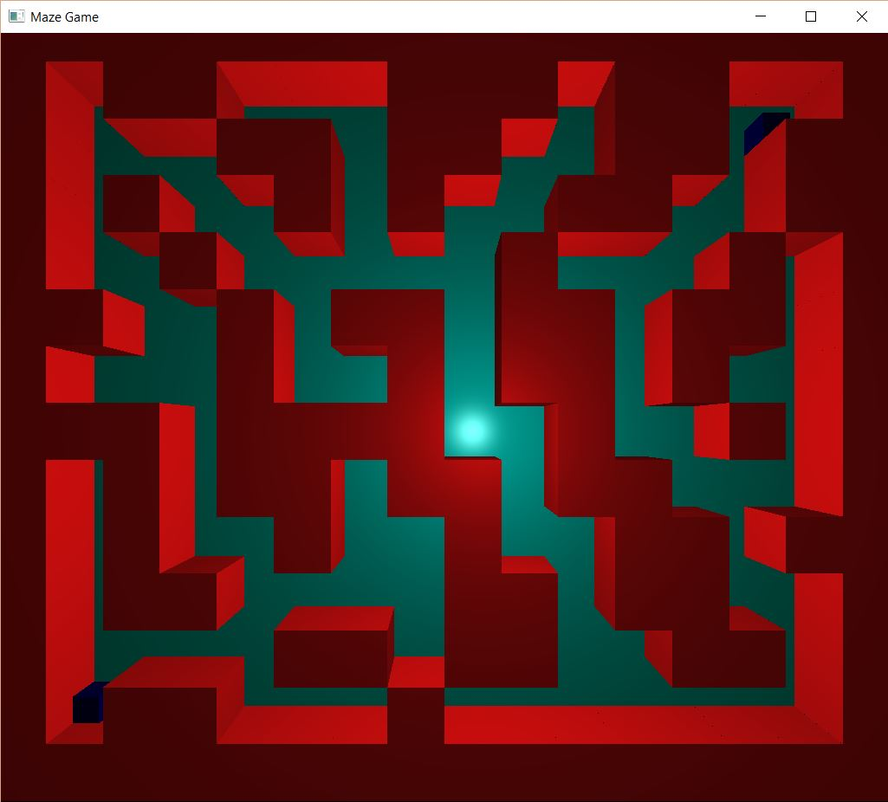

# Maze-Runner

Maze runner is a 3D game developed as a part of coursework. Features include bird eye view, random maze generation, mouse control, hot keys. Shader based Open GL version 4.0 along with GLFW, GLM and other libraries were used for interaction and computation.

